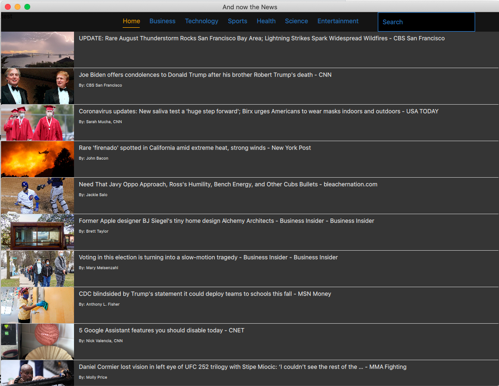
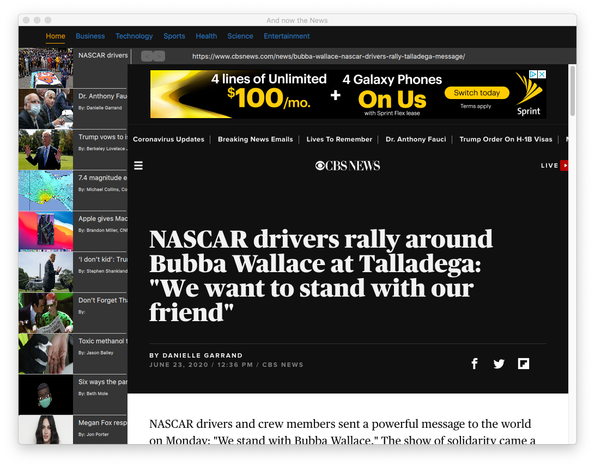
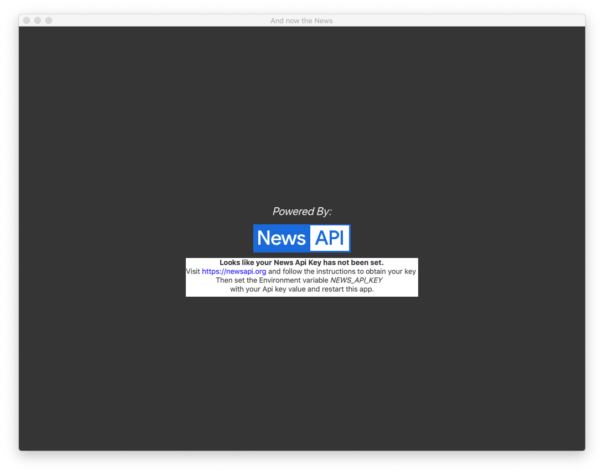

# NewsReader
A simple NewsApi viewer written in Qt Quick

# What it Is
Small Qt Quick demo app. Loads a list of news items from NewsApi.org and provides a UI to navigate between them.

The app starts off with a list to browse news stories. General news categories can be selected from the top navigation area. Selecting a new category will cause the list of news stories to update.

The user can also enter keyword search which will return a list of results in the form of news stories.

The user can then click on a story and [QtWebEngine](https://doc.qt.io/qt-5/qtwebengine-index.html) will render it.

# Getting Started

The splash page will display the following warning if the API key if not set:

For this application to work, you'll have to create an API key from newsapi.org. After creating your key, enter it in the field here. The app will remember it from then on,     
