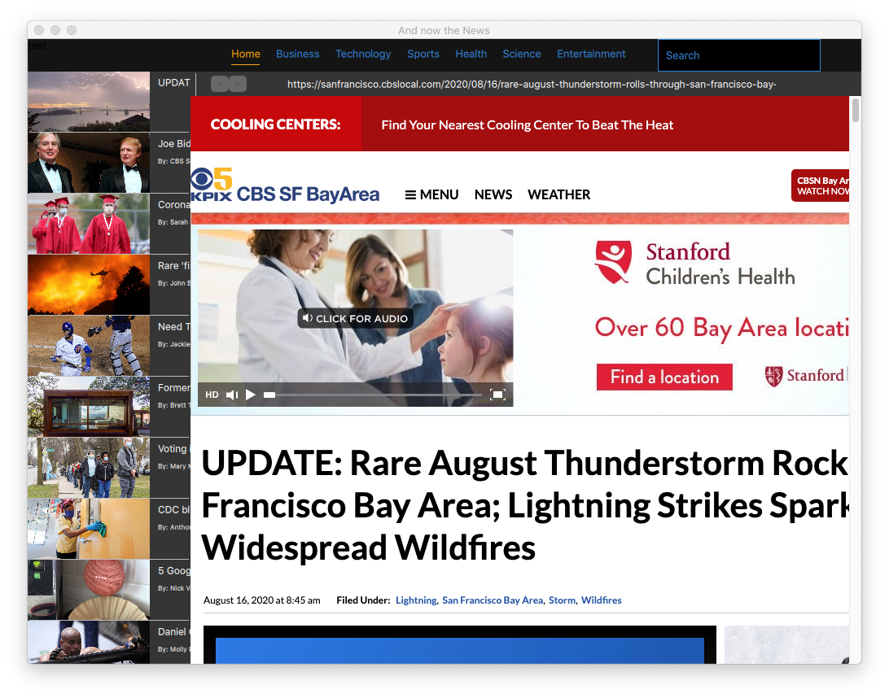
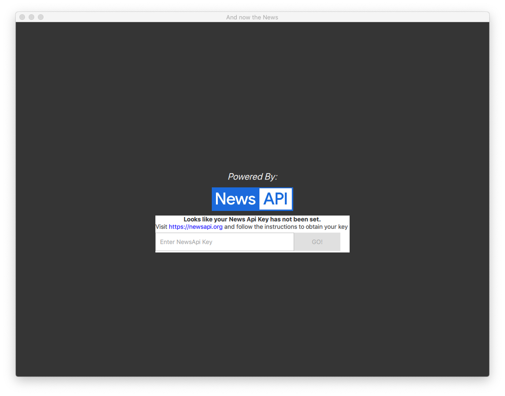

# NewsReader
A simple NewsApi viewer written in Qt Quick

# What it Is
Small Qt Quick demo app. Loads a list of news items from NewsApi.org and provides a UI to navigate between them.

The app starts off with a list to browse news stories.

The user can then click on a story and [QtWebEngine](https://doc.qt.io/qt-5/qtwebengine-index.html) will render it.

# Getting Started

The splash page will display the following warning if the API key if not set:

For this application to work, you'll have to create an API key from newsapi.org. Create an environment variable called 'NEWS_API_KEY' and set your api key as its value.     
